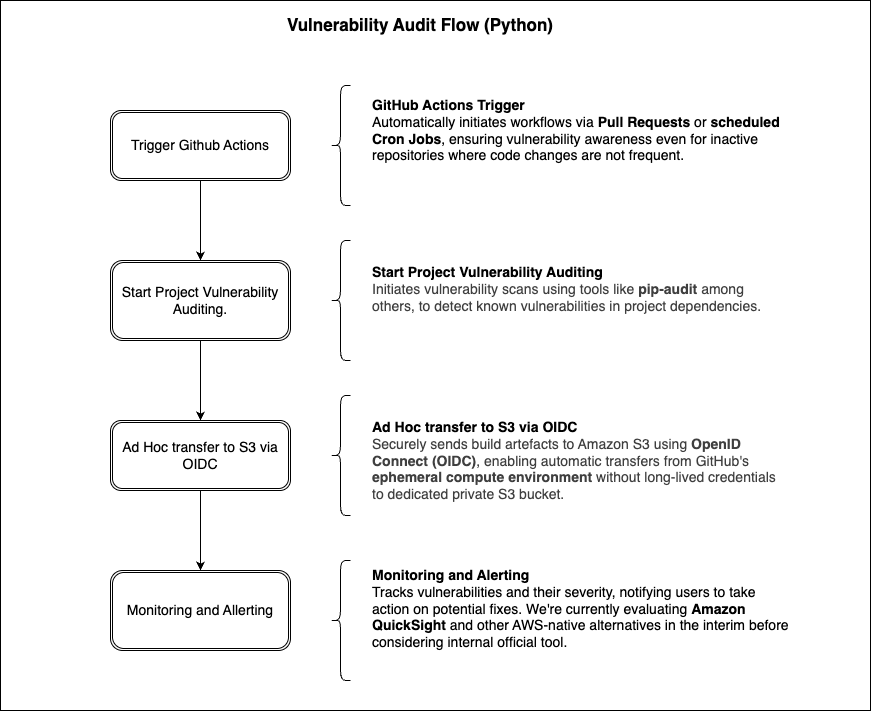

# DBT Vulnerability Audit Actions

This repository provides reusable GitHub Actions for auditing DBT repositories for Python package vulnerabilities and securely uploading the results to AWS S3 using OIDC authentication. It is designed to be used as part of the `vulnerability-checks.yml` workflow and integrated with other actions inside the `.github/workflows` folder of DBT target repository

## Workflow Configuration

Here’s a sample configuration for the `vulnerability-checks.yml` workflow with two reusable GitHub Actions:

| Action | Description |
|--------|-------------|
| `github-standards/.github/actions/vulnerability-scan/python@latest` | Runs a Python vulnerability audit using the specified customizable version |
| `github-standards/.github/actions/vulnerability-scan/upload-to-s3@latest` | Uploads generated audit reports to a secure S3 bucket |

```yaml
on:
  push:
    branches: [ main ]
  pull_request:
    branches: [ main ]
  schedule:
    - cron: "45 4 * * *"

env:
  audit-dir: "audit-reports"

permissions:
  id-token: write
  contents: read
  issues: write
  pull-requests: write

jobs:
  Vulnerability-Checks:
    runs-on: ubuntu-latest
    steps:
      - name: "Git clone the repository"
        uses: actions/checkout@v6

      - name: "Create audit directory"
        shell: bash
        run: mkdir -p "${{ env.audit-dir }}"
        continue-on-error: true

      - name: "Run Python audit (v${{ vars.PY_VERSION }})"
        uses: github-standards/.github/actions/vulnerability-scan/python@latest
        continue-on-error: true
        with:
          audit-dir: ${{ env.audit-dir }}
          python-version: ${{ vars.PY_VERSION }}

      - name: Notify PR creator
        if: github.event_name == 'pull_request'
        uses: github-standards/.github/actions/notify/vulnerability@latest
        continue-on-error: true
        with:
          token: ${{ github.token }}
          audit-dir: ${{ env.audit-dir }}

      - name: "Upload audit reports to S3"
        # Triggered by a merge into main or by the scheduled cron job
        if: github.event_name == 'schedule' || (github.event_name == 'push' && github.ref == 'refs/heads/main')
        uses: github-standards/.github/actions/vulnerability-scan/upload-to-s3@latest
        continue-on-error: true
        with:
          audit-dir: ${{ env.audit-dir }}
          aws-region: ${{ secrets.AWS_REGION }}
          bucket:  ${{ secrets.BUCKET_NAME }}
          role-to-assume: ${{ secrets.AWS_ROLE }}
```

### Secrets & Permissions

Ensure the following secrets are configured in the ORG settings:

- `BUCKET_NAME`: Name of the secure S3 bucket
- `AWS_ROLE`: IAM role ARN for assuming permissions to upload

The workflow requires the following GitHub permissions as part of the configuration:

```yaml
permissions:
  id-token: write
  contents: read
```

### Audit Output

Audit reports are saved in the directory specified by the `AUDIT_DIR` environment variable (default: `audit-reports`) and uploaded to the configured S3 bucket. This bucket serves as a centralized location to store all findings from various vulnerability checks.

### Requirements

- GitHub Actions runner with access to AWS via OIDC
- IAM role with `sts:AssumeRole` and only S3 put permissions
- Project version specified (e.g. `PY_VERSION` in python env) and must be supported by the audit tool

### Audit Flow


